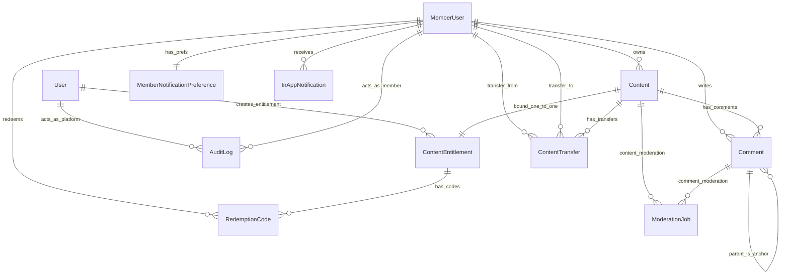

# 内容分享平台：Prisma 数据模型说明与 ER 图

| 项 | 说明 |
|----|------|
| **需求真源** | [`../product-specs/content-sharing-platform.md`](../product-specs/content-sharing-platform.md) |
| **技术方案** | [`content-sharing-platform-technical-design.md`](./content-sharing-platform-technical-design.md) |
| **Prisma 真源** | [`../../apps/server/libs/database/prisma/schema.prisma`](../../apps/server/libs/database/prisma/schema.prisma)（**以仓库为准**；本文为摘要） |
| **状态** | 与 PRD / 技术方案领域模型对齐；枚举与索引变更须同步本页与迁移 |

---

## 1. 总览

- **方言**：MySQL（`DATABASE_URL`）。
- **主体**：**`users` / `User`** 仅平台；**`member_users` / `MemberUser`** 仅 C 端（鉴权、Owner、兑换、评论、转让、通知）。
- **命名**：Prisma `model` PascalCase，**字段** camelCase；**MySQL 列名** **`snake_case`**（`@map`）；`@@map` 表名为 **snake_case 复数**。
- **主键**：`String` + `@default(uuid())` + `@db.Char(36)`，与 HTTP UUID 一致。
- **敏感数据**：兑换码、转让码、卡片凭证仅存 **hash**（见 [`../SECURITY.md`](../SECURITY.md)）。
- **模板与内容**：**无** `Content` → `ContentTemplate` 外键；选用模板 = 应用层覆盖 `Content.body`。
- **转让并发**：「同一内容仅一笔 **PENDING**」由事务 + 计划中的部分唯一索引或等价约束保证；现建有 `(content_id, status)` 普通索引。

---

## 2. ER 图（逻辑关系）

与 `schema.prisma` 中 `@relation` 一致。



**Comment 自关联**：**`anchorId`** 指向锚点（串内行非空）；**`parentId`** 在串内行恒为锚点 id（锚点行为 `null`）。**`ModerationJob`** 对 `Content` / `Comment` 外键二选一，由 `subjectType` 与写入方保证一致。

---

## 3. 模型与字段（按表）

字段级真源为 **`schema.prisma`**。下表只列 **契约与评审常用项**；其余列（时间戳、索引等）以 Prisma 为准。

### `users`（`User`）— 平台

| 字段 | 说明 |
|------|------|
| `id` | 管理端 JWT `sub`；`content_entitlements.created_by_user_id`、审计 `actor_user_id`。 |
| `email` / `passwordHash` | 管理端登录（bcrypt）。 |
| `platformAdmin` | `true` 可走管理端登录与写接口；完整 RBAC 前由该字段门控。 |

### `member_users`（`MemberUser`）— C 端

| 字段 | 说明 |
|------|------|
| `id` | C 端 JWT `sub`；Owner、兑换、评论、转让、通知均引用本表。 |
| `email` / `passwordHash` | 注册登录。 |
| `displayName` | 可选，≤64；`PATCH /api/v1/auth/me` 可写 `null` 清空。 |

### `contents`（`Content`）

| 字段 | 说明 |
|------|------|
| `ownerMemberId` | 占位期可空；兑换/转让确认后更新。 |
| `placeholderKind` | 如 `PLACEHOLDER` / `OWNED`。 |
| `title` / `body` | 建议 JSON 文档模型（`text` / `image` / `animation` 等块）。 |
| `publishStatus` | 与 PRD 发布与机审分支对齐的状态机。 |
| `listingState` | 与发布态正交：平台下架、紧急隐藏等。 |

**关系**：`ContentEntitlement` 1:1；`Comment`、`ContentTransfer`、`ModerationJob` 1:N。

### `content_entitlements`（`ContentEntitlement`）

`contentId` **唯一** → 与 `Content` 1:1；`createdByUserId`、`status`（如 `ACTIVE` / `ARCHIVED`）。

### `redemption_codes`（`RedemptionCode`）

`entitlementId`；**`codeHash` 唯一**；`status`（`ACTIVE` / `INVALIDATED` / `REDEEMED`）；`invalidatedAt` / `redeemedAt` / `redeemedByMemberId`。

### `content_templates`（`ContentTemplate`）

`title` / `body`；**`shelfStatus`**（上架/下架）；**`deletedAt`** 软删表达「删除不可恢复」。**无**指向 `contents` 的外键。

### `comments`（`Comment`）

`contentId`、`authorMemberId`；**`anchorId`** / **`parentId`** / **`replyToCommentId`**（二层规则见技术方案第 5.1 节）；`body`（JSON）；`publishStatus`；`deletedAt` 软删。

### `content_transfers`（`ContentTransfer`）

`contentId`、`fromMemberId`；`toMemberId`（确认后）；**`method`**（`CARD_SHARE` / `TRANSFER_CODE`）；`codeHash` / `cardTokenHash`；**`status`**；**`expiresAt`**（第 7 自然日 23:59:59，业务时区）。

### `moderation_jobs`（`ModerationJob`）

`subjectType`（`CONTENT` / `COMMENT`）；`contentId` 或 `commentId` 与之一致。

### `audit_logs`（`AuditLog`）

`actorUserId` **或** `actorMemberId`（应用层二选一）；`action`；`targetType` + `targetId`；`payload`（JSON）；**`traceId`**。选用模板 **不写** 审计。

### `member_notification_preferences` / `in_app_notifications`

偏好表：`memberId` PK/FK，渠道布尔开关。站内信：`memberId`、分类、标题、正文、`readAt`、可选 `data`（JSON）。

---

## 4. 枚举与产品语义（摘要）

| Prisma 枚举 | 产品对照 |
|-------------|----------|
| `ContentPublishStatus` | PRD 发布与机审 |
| `ContentListingState` | PRD 上架/干预 |
| `RedemptionCodeStatus` | PRD 兑换码生命周期 |
| `TransferStatus` + `expiresAt` | PRD 转让与过期任务 |
| `CommentPublishStatus` | PRD 评论机审 |

---

## 5. 命令与迁移

```bash
# 在 apps/server 下（见 ../BACKEND.md）
pnpm exec prisma validate --schema=libs/database/prisma/schema.prisma
pnpm exec prisma format --schema=libs/database/prisma/schema.prisma
pnpm exec prisma generate --schema=libs/database/prisma/schema.prisma
pnpm run db:migrate:dev    # 改 schema 后生成并应用迁移（开发机）
pnpm run db:migrate:deploy # 空库 / CI / 生产：仅应用已有 migrations
```

版本化 DDL 位于 **`libs/database/prisma/migrations/`**；`pretest:e2e` 与 **`scripts/e2e-db-migrate-deploy.cjs`** 使用 **`prisma migrate deploy`**。临时对齐空库仍可用 **`prisma db push`**（不落迁移文件，勿替代生产流程）。

---

## 6. 变更记录（摘要）

| 日期 | 变更 |
|------|------|
| 2026-05-11 | 首版：业务表、枚举、ER 图与索引说明 |
| 2026-05-12 | 拆分 `User` / `MemberUser`；C 端字段与关系迁至 `member_users`；**`MemberUser.displayName`** |
| 2026-05-12 | MySQL **列名**统一为 **`snake_case`**（Prisma `@map`）；重写 **`20260512100000_init`** DDL |
